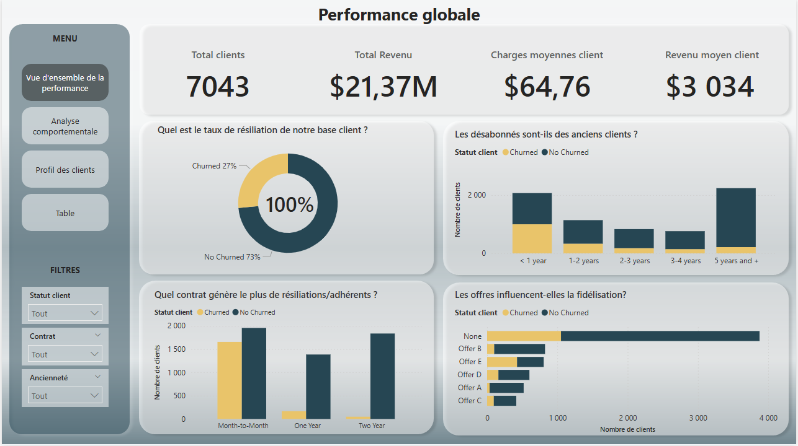
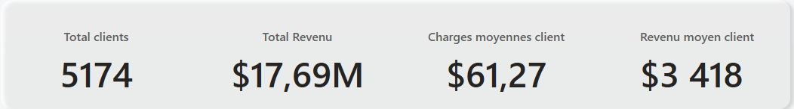
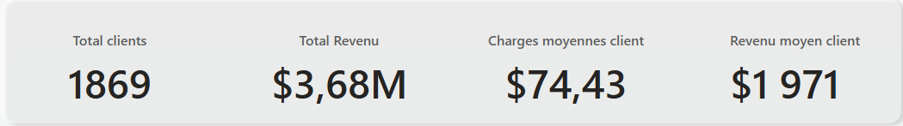
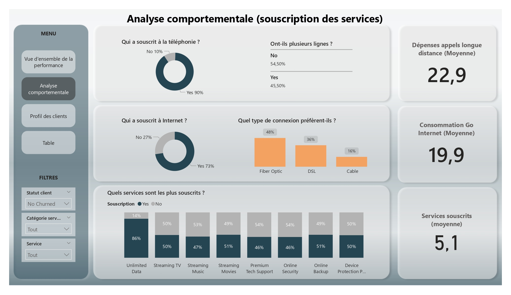
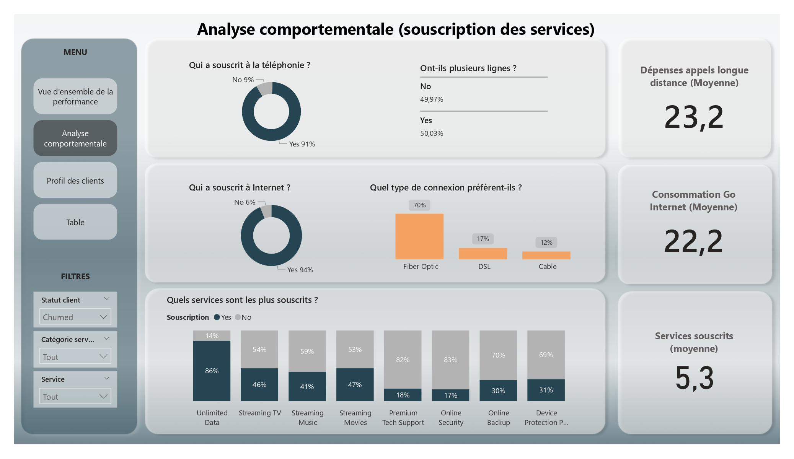
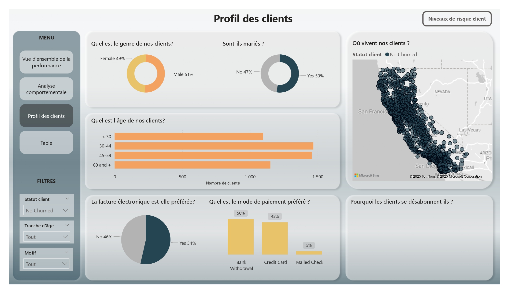
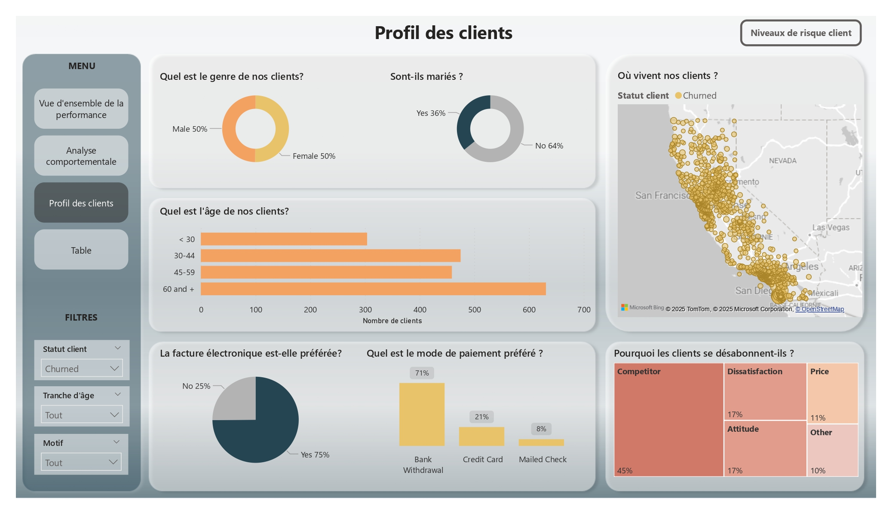

  

# 📡 Analyse des désabonés (churn) - PulseLink

## 🔵 Contexte

PulseLink est un opérateur de télécommunications américain qui propose des services de téléphonie et d'accès internet. L'entreprise propose des abonnements variés allant de la ligne téléphonique simple à multiple, divers connexions internet ainsi que des services numériques complémentaires.

Dans un secteur de plus en plus concurrentiel, PulseLink souhaite consolider sa base client existante car fidéliser un client coûte moins cher que d'en recruter un nouveau, et les clients churnés (les désanonnés) représentent une source d'information précieuse pour identifier les failles des offres et des services.

Cette analyse permettra de définir le profil des clients les plus enclins à se désabonner, et quels services, offres, contrats ont une influence significative sur le désabonnement.

## 🟢 Objectifs

L'objectif de ce projet est de construire un rapport composé de plusieurs dashboards interactifs pour :

- Suivre la performance globale de l'entreprise en fonction des statuts (actifs/inactifs).
- Analyser la souscription des services proposés et identifier ceux associés à un taux de désabonnement plus élevé.
- Étudier le profil des clients afin de détecter les plus à risque de se désabonner.
- Fournir des recommandations pour améliorer la fidélisation et limiter la hausse du taux de désabonnement

## 🟡 Données utilisées

**Nombre de clients dans la base** : 7064  
**Nombre de clients actifs** : 5174  
**Nombre de désabonnés** : 1869  

Données utilisées concernent :

- Données sociodémographiques des clients : genre, âge, statut marital, ville de résidence, etc.
- Des informations contractuelles : type de contrat, ancienneté, offres souscrites.
- Services souscrits : téléphonie, internet, support, sécurité.
- Des informations sur la consommation : données, appels longue distance.
- Le statut client : actif ou désabonné.

## 🔵 Sources de données

Les données utilisées dans ce projet proviennent du site : [Mayven Analytics](https://mavenanalytics.io/)
Lien du dataset : https://mavenanalytics.io/data-playground/telecom-customer-churn

## 🟣 Méthodologie

1. **Nettoyage et préparation des données** :

- Transformation des données sous Power Query : 
 - vérification des valeurs dupliquées.
 - correction des données incohérentes (dépenses mensuelles négatives).
 - création de colonnes personnalisées et conditionelles (catégorie des services, tranches d'âge)

2. **Modélisation des données**

- Créer des tables de dimensions et de fait
- Établir les relations entre les tables
- Création d'un modèle en étoile

3. **Création de KPIs**

- Revenu total
- Revenu moyen par client
- Charges mensuelles 
- Dépense moyenne appels longue distance
- Moyenne de services soucrits
- Consommation moyenne des données (Go)

2. **Visualisations**

- Dashboards interactifs et dynamiques avec filtres par statut, ancienneté, contrat, etc.
- Création d'une table de scoring (score de risque client) pour identifier les clients les plus à risque

## 🟠 Résultats

**1. Dashoard 1 : Vue d'ensemble de la performance par statut**

Les désabonnés représentent 27 % de la base client. Ils sont en grande majorité récent (ancienneté < 1 an), préférent le contrat "Month-to-Month" (sans engagement et se montrent peu intéressés par les offres proposées).

En moyenne, Les désabonnés dépensent plus par mois que les actifs (74 $ vs 61 $)

**2. Dashboards 2 : Analyse comportementale (services souscrits)**

Plus de 90 % des désabonnés ont souscrit aux services de téléphonie et/ou internet. Leur consommation moyenne est légèrement plus élevée, que ce soit pour les données internet (22 Go vs 20 Go) ou les appels longue distance (+ 23 $).
Même si le nombre moyen de services souscrits est identique entre les deux groupes, on remarque que les désabonnés sont beaucoup moins enclins à souscrire aux services d'assistance et de sécurité (Premium tech support, Online security and Backup, Device protection).

**3. Dashboard 3 : Profil client**

Les clients ayant 60 ans et plus représentent une part importante des désabonnés, suivis par la tranche 30-44 ans. 
La majorité des désabonnés choisissent la facture électronique et le paiement par chèque.
Enfin, plus des 40 % déclarent s'être tournés vers la concurrence, attirés par des offres plus compétitives.

**Conclusion**

Les désabonnés sont moins nombreux que les clients actifs mais se révèlent être de gros consommateurs de téléphonie et d'internet.

Leur profil type : 
- une ancienneté faible
- peu d'engagement contractuel
- peu d'intérêt pour les offres commerciales
- une faible adoption des services de support/sécurité

📄

## 🟡 Recommendations

- Réviser les offres commerciale pour qu'elles soient mieux alignées avec celles de la concurrence.
- Valoriser les services de support et de sécurité auprès des clients (témoignages, résultats d'enquêtes de satisfaction, etc.)
- Proposer des offres groupées incluant des services de support/sécurité pour inciter à leur adoption
- Surveiller les clients à risque via la table de scoring afin d'anticiper le churn et cibler les actions de rétention.

## ⚪ Technologies/outils utilisés

- **Excel** : exploration des données initiales
- **Power Query**  : préparation et nettoyage des données
- **Power BI** : dashboards interactifs et dynamiques
- **Powerpoint** : communication des résultats

## 🟣 Compétences développées

### Compétences techniques :

- Nettoyage et préparation des données
- Modélisation de données
- Mesures DAX (KPIs, scoring, etc.)
- Création de dashboards interactifs
- Storytelling via des visualisations claires et adaptées.
- 

### Compétences transversales : 

- Compréhension des besoins métiers
- Communication claire des résultats
- Esprit critique dans l'interprétation des données
- Organisation et rigueur dans la structuration du projet
